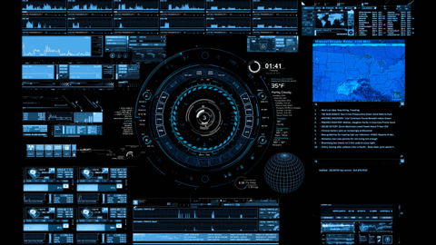

<h1 align="center" style="text-color:red;">Hi 👋, I'm Ankit kushwaha</h1>
<h3 align="center">Experienced Ethical Hacker and Web Developer</h3>

<a href="https://git.io/typing-svg"></a>

 
   
- 🔭 I’m currently working on **Arduino**

- 🌱 I’m currently learning **AI Robotics**

- 👨‍💻 All of my projects are available at [https://web-vite-kappa.vercel.app/](https://web-vite-kappa.vercel.app/)

- 📫 How to reach me **ankitkushwahahacker99109@gmail.com**

 <div style="display: flex; ">
<table>
  <tr>
    <td align="center" width="96">
        
      <br>React
    </td>
    <td align="center" width="96">
      <a href="#macropower-tech">
        
      </a>
      <br>Python
    </td>
    <td align="center" width="96">
        
      <br>JavaScript
    </td>
    <td align="center" width="96">
        
      <br>C++
    </td> </tr>
  <tr>
    <td align="center" width="96">
        
      <br>Webpack
    </td>
    <td align="center" width="96">
        
      <br>MySQL
    </td>
    <td align="center" width="96">
        
      <br>TypeScript
    </td>
    <td align="center" width="96">
        
      <br>AWS
    </td>
  </tr>
</table>
  <table>
  </tr>
  <tr>
    <td align="center" width="96">
        
      <br>Github
    </td>
    <td align="center" width="96"> 
        
      <br>Git
    </td>
    <td align="center"  width="96">
        
      <br>HTML5
    </td>
    <td align="center" width="96">
        
      <br>CSS
    </td>
    <td align="center" width="96">
        
      <br>Nodejs
      </td>
      <td align="center" width="96">
        
      <br>Sass
    </td>
    </tr>
    <tr>
    <td align="center" width="96">
        
      <br>Tailwind
    </td>
    <td align="center" width="96">
        
      <br>jQuery
    </td>
    <td align="center" width="96">
        
      <br>PostgreSQL
    </td>
      <td align="center" width="96">
        
      <br>MongoDB
    </td>
      <td align="center" width="96">
        
      <br>WordPress
    </td>
    <td align="center"  width="96">
        
      <br>Bootstrap
    </td>
      </tr> 
     

</table>
</div>


<p></p>

<p>&nbsp;</p>

<p></p>


### ```Last week I spent time on:```


<!--START_SECTION:waka-->

```text
JavaScript     ███████████████▒░░░░░░░░░   61.19 %
React          █████████▒░░░░░░░░░░░░░░░   31.49 %
Firebase       █████▒░░░░░░░░░░░░░░░░░░░   07.32 %
```

<!--END_SECTION:waka-->
<p align="center">  </p>

Any suggestions/remarks?🥺👉👈<br/>
Just drop me a [<b>Chitthi</b>](mailto:epsitbhardwaj26@gmail.com)!

