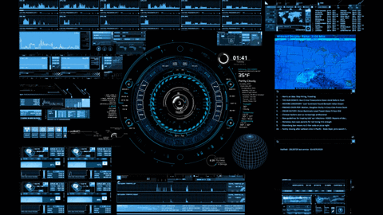

<h1 align="center" style="color: red;">Hi 👋, I'm Ankit Kushwaha</h1>
<h3 align="center">Ethical Hacker & Web Developer</h3>

  

  

---

### About Me

- 🔭 **Currently Working On:** Arduino  
- 🌱 **Currently Learning:** AI Robotics  
- 👨‍💻 **Projects:** Check out all my projects at [My Projects](https://web-vite-kappa.vercel.app/)  
- 📫 **Contact:** [ankitkushwahahacker99109@gmail.com](mailto:ankitkushwahahacker99109@gmail.com)

---

### Tech Stack

  <table>
    <tr>
      <td align="center" width="96">
        
         React
      </td>
      <td align="center" width="96">
        
         Python
      </td>
      <td align="center" width="96">
        
         JavaScript
      </td>
      <td align="center" width="96">
        
         C++
      </td>
    </tr>
    <tr>
      <td align="center" width="96">
        
         Webpack
      </td>
      <td align="center" width="96">
        
         MySQL
      </td>
      <td align="center" width="96">
        
         TypeScript
      </td>
      <td align="center" width="96">
        
         AWS
      </td>
    </tr>
    <tr>
      <td align="center" width="96">
        
         GitHub
      </td>
      <td align="center" width="96">
        
         Git
      </td>
      <td align="center" width="96">
        
         HTML5
      </td>
      <td align="center" width="96">
        
         CSS
      </td>
      <td align="center" width="96">
        
         Node.js
      </td>
      <td align="center" width="96">
        
         Sass
      </td>
    </tr>
    <tr>
      <td align="center" width="96">
        
         Tailwind CSS
      </td>
      <td align="center" width="96">
        
         jQuery
      </td>
      <td align="center" width="96">
        
         PostgreSQL
      </td>
      <td align="center" width="96">
        
         MongoDB
      </td>
      <td align="center" width="96">
        
         WordPress
      </td>
      <td align="center" width="96">
        
         Bootstrap
      </td>
    </tr>
  </table>

<!-- Uncomment the following line to display GitHub stats -->
<!-- 

 -->

Any suggestions/remarks? 🥺👉👈  
Just drop me a [Chitthi](mailto:ankitkushwahahacker99109@gmail.com)!
